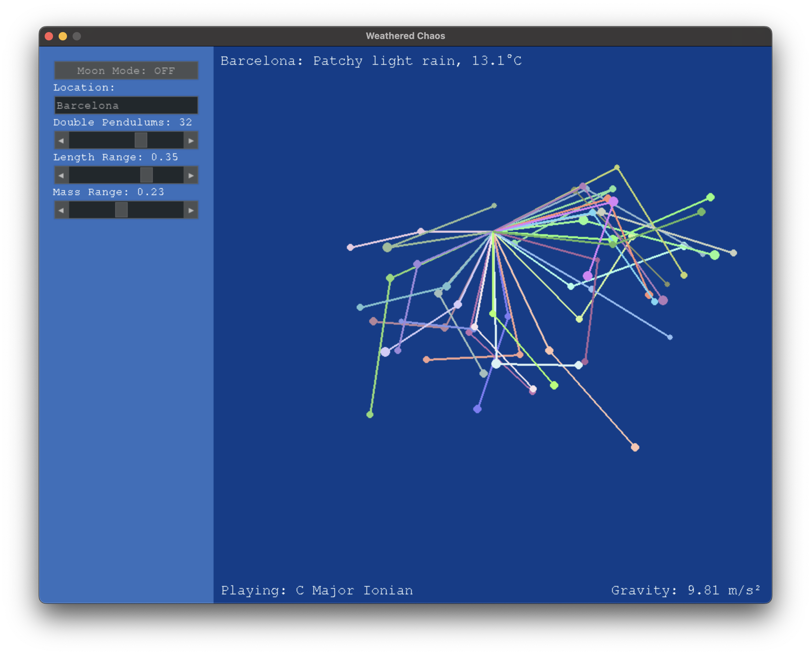

# Weathered Chaos

A Python application that generates music based on current weather conditions and the chaotic behavior of a double pendulum system.



## Overview

Weathered Chaos combines real-time weather data with the unpredictable dynamics of double pendulums to create unique, ever-changing musical compositions. The project uses neural audio synthesis techniques to transform these inputs into soundscapes that reflect both environmental conditions and chaotic mathematical patterns.

## Demo

Here's the link of a demo of the program: [Watch the Demo](https://www.youtube.com/watch?v=SVjPm2dIonA)

## Features

- **Weather Integration**: Fetches real-time weather data using the integrated WeatherAPI.py
- **Double Pendulum Simulation**: Simulates chaotic double pendulum physics with PendulumSystem.py
- **Sound Generation**: Converts data into music by sending MIDI data to your DAW via MIDISonifier.py and by using RAVE neural audio synthesis via RAVESonifier.py
- **Visualization**: Provides visual representation of the pendulum systems with Visualizer.py
- **Event System**: Manages application events through EventManager.py
- **User Interface**: Includes a sidebar component (Sidebar.py) for user interaction

## Installation

1. Clone the repository:
   ```bash
   git clone https://github.com/yourusername/weathered-chaos.git
   cd weathered-chaos
   ```

2. Create and activate a virtual environment (use Python 3.10):

    Using `venv`:
    ```bash
    python -m venv venv
    source venv/bin/activate  # On Windows: venv\Scripts\activate
    ```

    Using `conda`:
    ```bash
    conda create -n weathered-chaos python=3.10
    conda activate weathered-chaos
    ```

3. Install dependencies:
   ```bash
   pip install -r requirements.txt
   ```

4. Download RAVE model weights:
    ```bash
    python download_rave_weights.py
    ```
    This script will create a rave_model_weights directory and download the required pre-trained neural audio models.

5. Set up your environment variables:
    - Create a `.env` file in the root directory of the project.
    - Add the following variable to the `.env` file:
      ```env
      WEATHER_API_KEY=your_weatherapi_key
      ```
    - Replace `your_weatherapi_key` with your actual API key, which you can generate for free by signing up at [weatherapi.com](https://www.weatherapi.com/).

## DAW MIDI Configuration

To route MIDI from `MIDISonifier.py` into your DAW:
1. Ensure your DAW is set to receive MIDI from virtual ports (e.g., IAC Bus on macOS).
2. In `MIDISonifier.py`, confirm you’re sending MIDI to the same virtual port.
3. Verify MIDI preferences in your DAW recognize the virtual port as an input source.
4. Launch the application, and your DAW should receive MIDI events in real time.

## Usage

Run the application:

```bash
python main.py
```

The application will:
1. Connect to the weather API to fetch current conditions
2. Initialize the double pendulum simulation
3. Generate music based on the configured mappings in weather_music_mapping.json and rave_weights_mapping.json
4. Display the visualization interface

## Testing

Run the test suite with:

```bash
pytest
```

## Project Structure

- .env - Environment variables
- Config.py - Application configuration
- EventManager.py - Event handling system
- main.py - Application entry point
- MIDISonifier.py - MIDI-based audio generator
- PendulumSystem.py - Double pendulum physics implementation
- RAVESonifier.py - RAVE-based audio generator
- Sidebar.py - Interactable sidebar for the Visualizer
- Visualizer.py - Visual rendering of pendulums
- WeatherAPI.py - Weather data integration
- weather_music_mapping.json - Weather to music parameter mappings
- rave_weights_mapping.json - Neural audio model configurations
- rave_model_weights - Trained RAVE model weights
- tests - Test suite

## License

This project is licensed under the **MIT License**.

The MIT License allows for both personal and commercial use, modification, and distribution, provided that proper credit is given to the original author. For more details, see the [MIT License](https://opensource.org/licenses/MIT).
